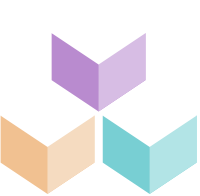

<strong class="has-text-grey-light is-size-4 has-text-weight-bold">BDS</strong>

<h1 class="title is-size-3-mobile has-text-weight-bolder is-family-primary">Biings Design System</h1>

    

        <a href="#/layout" class="box is-medium is-popping has-background-primary-dark">
            
            

            <h4 class="title has-text-white is-family-primary"><strong>Foundation</strong></h4>
            
Layout, Typography, Color, etc

        </a>
    

    

        <a href="#/avatar" class="box is-medium has-background-purple-lighter is-raised hover-to-floating">
            
            

            <h4 class="title has-text-dark is-family-primary"><strong>Components</strong></h4>
            
All you need to build your UIs

        </a>
    

    BDS is a series of assets and guidelines for building consistent user experiences at Biings. This design system is open-source under a CC BY 4.0 License.

    

        

            
        

        
&nbsp;•

        

            <a href="#/CHANGELOG"
               class="is-size-6 has-text-weight-medium">Release Notes</a>
        

    

<h4 class="title is-family-primary"><strong>Quick start</strong></h4> 

<strong>1 )</strong> Install BDS in your project using the npm package <strong>biings-ds</strong>.  

    npm install biings-ds

<strong>2 )</strong> The two files below are enough to start using BDS (fonts must be added seperately).  

<a href="https://raw.githubusercontent.com/biings/biings-ds/master/build/bds.css" class="box is-bordered has-text-grey-darker" download>**bds.css** The only CSS file you'll need to use Biings DS.</a>
<a href="https://raw.githubusercontent.com/biings/biings-ds/master/build/bds-icons.min.svg" class="box is-bordered has-text-grey-darker" download>**bds-icons.svg** An SVG sprite - created with svgstore - that includes all Biings DS icons.</a>

    

        

            
Want to <u>contribute?</u>

            
Onboarding for designers and developers wanting to contribute.

        

        

            <a href="#/contribute" class="button is-rounded is-dark is-shadowed is-beefy">Start contributing</a>
            

            Or go straight to our <a href="https://github.com/biings/biings-ds" class="is-underlined">GitHub</a> repo.
        

    

