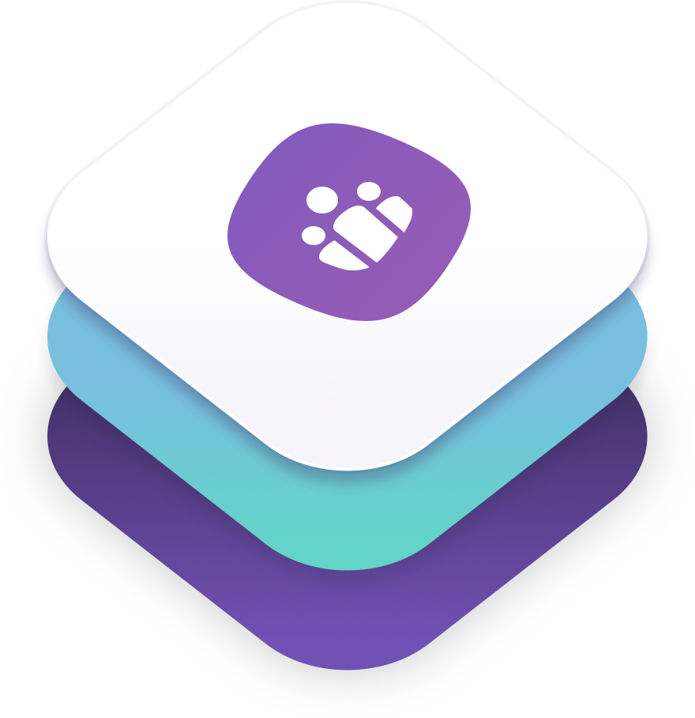

<!-- _coverpage.md -->

    

        
        

        <h1 class="title is-0 is-size-2-mobile has-text-dark is-family-secondary has-text-weight-bold is-spaced">Biings Design System</h1>
        
The single source of truth for building Biings products

        

        <a href="#/?id=main" class="button is-medium is-dark is-beefy is-glowing is-hidden-mobile">Start exploring</a>
        

        
    

