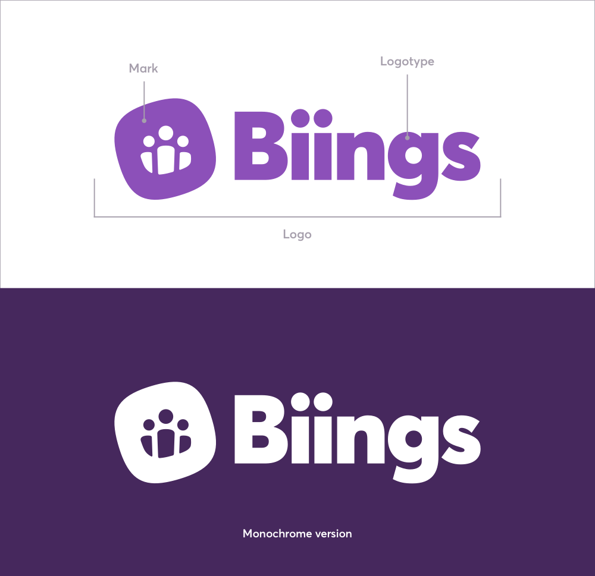

<h6 class="is-uppercase is-dimmed has-text-weight-medium is-size-6 is-size-7-mobile">Foundation</h6>
<h1 class="title is-size-2-mobile">Brand guidelines</h1>

    This section outlines the building blocks of the Biings brand, including what we stand for, the words we use and how to use our logo.

 

<h3 class="title is-family-primary has-text-weight-bold">Logo and mark</h3>

The Biings logo includes the mark and the logotype.

The mark can be used alone when the context is clear (eg. on a diagram or as an icon). The logotype should never appear without the mark. The mark should always be on the left.

?> Logos can be downloaded from our <a class="has-text-weight-medium is-underlined" href="https://biings.com/en/press">Press page</a>.