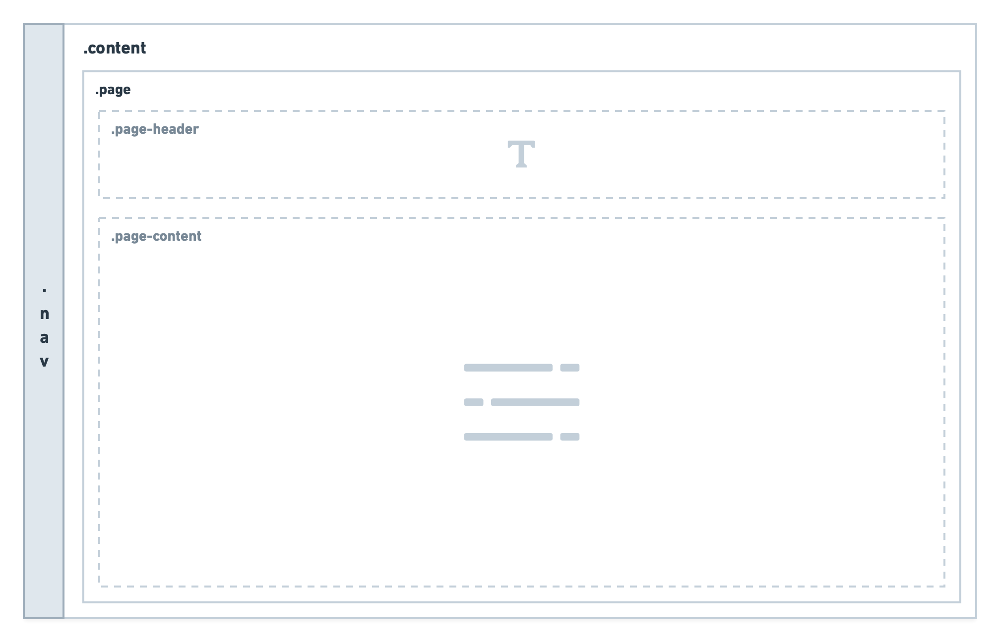
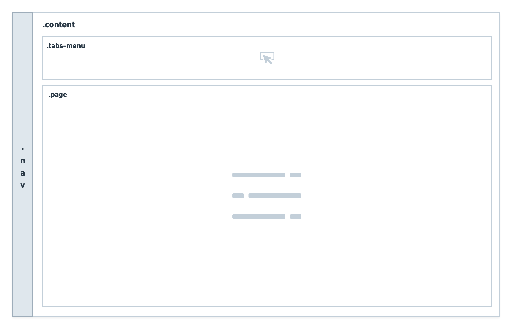
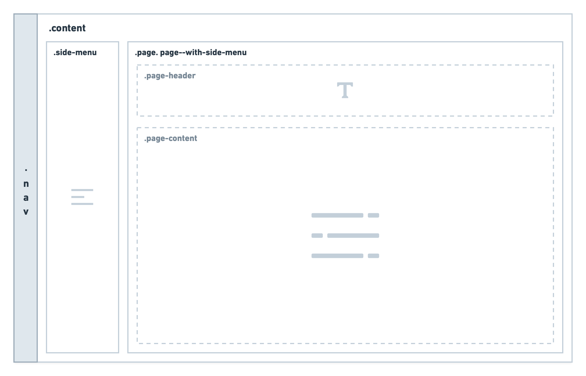

<h6 class="subtitle is-6 is-uppercase has-text-grey">Component</h6><h1 class="title is-serif is-1 has-text-weight-bold">Layout</h1>

    Layout is the page structure in which content and components live.

<h2 class="title is-4 is-family-sans-serif">Columns</h2>

Columns are used to structure content horizontally. Biings DS uses a responsive fluid system that automatically scales up to 12 columns.

  

      

        
 First  

      

      

        
 Second  

      

      

        
 Third  

      

      

        
 Fourth  

      

    

  

  
      

        
First

        
Second

        
Third

        
Fourth

      

 
<a href="https://bulma.io/documentation/columns/" target="blank" class="box is-bordered">
    More possibilities on &nbsp;→&nbsp; <strong class="has-text-primary">Bulma / Columns</strong>
</a>
  

<h2 class="title is-4 is-family-sans-serif">Level</h2>

Use **Level items** when you need to vertically center elements on one line.

  

    

      

 &nbsp; &nbsp; Item 1 &nbsp; &nbsp;  

      

 &nbsp; &nbsp; Item 2 &nbsp; &nbsp;  

      

 &nbsp; &nbsp; Item 3 &nbsp; &nbsp;  

    

    

        

 &nbsp; &nbsp; Item 4 &nbsp; &nbsp;  

        

 &nbsp; &nbsp; Item 5 &nbsp; &nbsp;  

    

  

    

      

        
Item 1

        
Item 2

        
Item 3

      

      

          
Item 4

          
Item 5

      

    

 
<a href="https://bulma.io/documentation/layout/level/" target="blank" class="box is-bordered">
    More possibilities on &nbsp;→&nbsp; <strong class="has-text-primary">Bulma / Level</strong></a>

<h2 class="title is-4 is-family-sans-serif">Content Layout</h2>

  
<a href="#/layout?id=basic">Basic</a>

  
<a href="#/layout?id=page">Page</a>

  
<a href="#/layout?id=menu">Page with Menu</a>

!> **Content Layout** is used only in a Biings Desktop or Tablet app.

<h2 class="title is-5">Basic</h2>

A **Basic** layout has no margin or padding and allows the content to stretch and fill the entire stage.

    

      
...

      

          ...
      

    

<h2 class="title is-5">Page</h2>

A **Page layout** has responsive padded content. Add `.is-centered` for fixed width centered content.

    

      
...

      

        

          ...
        

      

    

<h2 class="title is-5">Page with Menu</h2>
Similar to the Page layout with an additional **Side-menu** for quick navigation.

    

      
...

      

        

          ...
        

        

          ...
        

      

    

